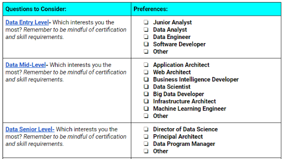
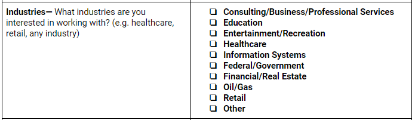
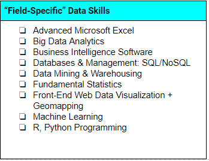
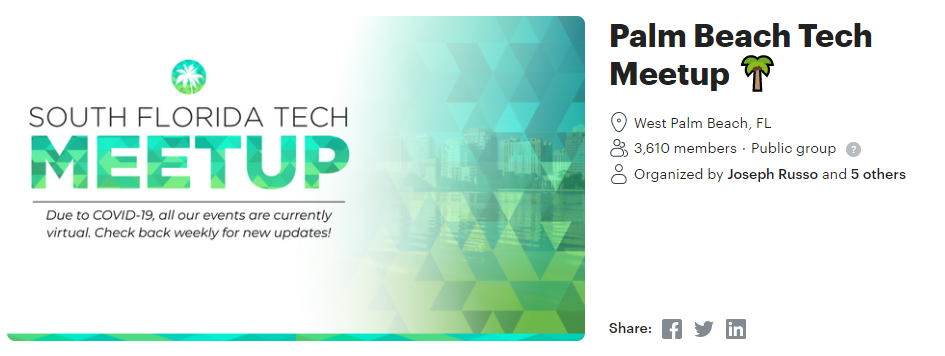

# project-2 Jobs
**Project table of contents**

1. Purpose - Mission / Vision
2. Data Sources
3. Dashboard / Visualizations

----

- More details

## 1. Purpose

### **Vision**

- Create a useful web application to help search for data analytics jobs

### Mission

- Develop a dashboard application with jobs related to:
  - Data Analytics
  - Data Science

## 2. Data Sources

### Possible Datasets

Kaggle:

- https://www.kaggle.com/andrewmvd/data-analyst-jobs
- https://www.kaggle.com/promptcloud/jobs-on-naukricom

### Possibility to Scrape / Data Mine

- Glassdoor
- Company websites (based on website license)

## 3. Dashboard

- Filters

  - Experience, Industry, Skills, Location

- Visualizations

  - Possible Geomapping with Leaflet.js for with location data

  

#### More Details:

##### Filters:

- Experience

  

  

- Industry

  

- Skills

  

- Location

  

## Bootcamp spot career services:

- [Pave Your Pathway: Data Career Paths - 02.12.2020](https://youtu.be/OlbcdOhzrzw)
  - google doc: [Pave Your Pathway Google Doc - **copy first**](https://docs.google.com/document/d/1rLtvmbrlHYLFXpVWJ9yV2RgKgf6Z5dceBaqPqOXA3OI/)

### Different filter terms?:

### Local Tech Meetups:

#### 1. [Palm Beach Tech Meetup](https://www.meetup.com/PalmBeachTech/)

### Company Websites:

- UnitedHealthcare - https://careers.unitedhealthgroup.com/
- HCA Corporate - https://careers.hcahealthcare.com/
- Veteran's Association - https://www.vacareers.va.gov/

